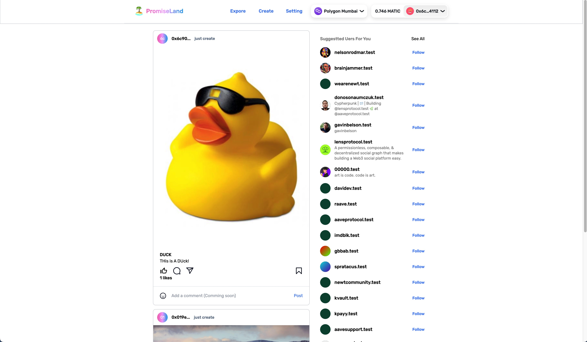

<!-- PROJECT LOGO -->
<br />
<div align="center">
  <a href="https://github.com/PromiseLand-App">
    
  </a>

  <h3 align="center">PromiseLand</h3>

  <p align="center">
    PromiseLand is an Instagram-liked Web3 Social and NFT marketplace that can benefit both content creators and their supportors with inbuilt Social-Fi elements.
    <br />
    <a href="https://github.com/othneildrew/Best-README-Template"><strong>Check out the DEMO »</strong></a>
    <br />
    <br />
    <a href="">View Demo Video</a>
    ·
    <a href="https://github.com/othneildrew/Best-README-Template/issues">EthOnline Showcase Link</a>
    
  </p>
</div>

<!-- TABLE OF CONTENTS -->
<details>
  <summary>Table of Contents</summary>
  <ol>
    <li>
      <a href="#about-the-project">About The Project</a>
      <ul>
        <li><a href="#built-with">Built With</a></li>
      </ul>
    </li>
    <li>
      <a href="#getting-started">Getting Started</a>
      <ul>
        <li><a href="#prerequisites">Prerequisites</a></li>
        <li><a href="#installation">Installation</a></li>
      </ul>
    </li>
    <li><a href="#usage">Usage</a></li>
    <li><a href="#roadmap">Roadmap</a></li>
    <li><a href="#contributing">Contributing</a></li>
    <li><a href="#license">License</a></li>
    <li><a href="#contact">Contact</a></li>
    <li><a href="#acknowledgments">Acknowledgments</a></li>
  </ol>
</details>

<!-- ABOUT THE PROJECT -->

## About The Project

<div align="center">
  <a href="https://promiseland.app" >
    
  </a>
</div>

PromiseLand is a Instagram liked Web3 Native social dapp where u

### Problem Statement

- The traditional social media platform where the content creators are hard to get rewarded if they created some viral content if they are not sponsored. Overall, they are hard to get paid for creating popular content.
- For the content creators’ followers, if they are elderly supporters, they are hard to share the success of the content creator they supported gets successful.

### Proposed Solution

- PromiseLand is built for content creators and their fans. Content creators can create their work most likely pictures as NFT to their own NFT collections. They can upload any images they want including their artwork, photograph, or just a selfie as NFT which is stored permanently in blockchain and IPFS. Their NFT can be traded and liked on our platform.
- But not only content creators can be benefited by selling their digital content as NFT. Their fans can also be rewarded by liking their favorite content. The earlier they like the NFT, they will get a higher reward after the NFT gets sold.

## How it works

In PromiseLand, any user with a crypto wallet can post their favorite image like digital art, photograph, or even memes in PromiseLand as "NFT" with only the cost of a gas fee. The user's supporter can like their favorite content by clicking like button to the NFT post with a small tip. When the NFT post got sold, all the tips will be transferred to the seller and likers can earn some shares from the sale using our promiseland smart contract.

<p align="right">(<a href="#readme-top">back to top</a>)</p>

### Built With

- IPFS
- Polygon
- Optimism
- ENS
- Lens
- NFTPort
- Worldcoin

### Support Chains

- Polygon Mumbai
- Polygon Mainnet
- Optimism
- Goerli Testnet

<p align="right">(<a href="#readme-top">back to top</a>)</p>

<!-- GETTING STARTED -->

## Getting Started

This is an example of how you may give instructions on setting up your project locally.
To get a local copy up and running follow these simple example steps.

### Prerequisites

This is an example of how to list things you need to use the software and how to install them.

- yarn
  ```sh
  yarn
  yarn run dev
  ```

### Run the App

1. Clone the repo
   ```sh
   git clone https://github.com/PromiseLand-App/promiseland-frontend
   ```
2. Install packages
   ```sh
   yarn install
   ```
3. Add your environment variables in `.env`

   ```sh
   NEXT_PUBLIC_WEB3_STORAGE_API_TOKEN=
   NEXT_PUBLIC_NFTPORT_API_KEY=
   ```

<p align="right">(<a href="#readme-top">back to top</a>)</p>

<!-- ROADMAP -->

## Roadmap

- [x] Basic Contract
- [x] MVP Launched
- [ ] Refine the contract and product
- [ ] Launch V1.0 Beta
- [ ] PromiseLand Token
- [ ] PromiseLand DAO
- [ ] Launch mobile app

See the [open issues](https://github.com/othneildrew/Best-README-Template/issues) for a full list of proposed features (and known issues).

<p align="right">(<a href="#readme-top">back to top</a>)</p>

<!-- CONTRIBUTING -->

## Contributing

Promiseland is open source. Any contributions you make are **greatly appreciated**.

If you have a suggestion that would make this better, please fork the repo and create a pull request. You can also simply open an issue with the tag "enhancement".
Don't forget to give the project a star! Thanks again!

1. Fork the Project
2. Create your Feature Branch (`git checkout -b feature/AmazingFeature`)
3. Commit your Changes (`git commit -m 'Add some AmazingFeature'`)
4. Push to the Branch (`git push origin feature/AmazingFeature`)
5. Open a Pull Request

<p align="right">(<a href="#readme-top">back to top</a>)</p>

<!-- LICENSE -->

## License

Distributed under the MIT License. See `LICENSE.txt` for more information.

<p align="right">(<a href="#readme-top">back to top</a>)</p>

<!-- CONTACT -->

## Contact

Bruce Wang - [@brucewangdev](https://twitter.com/brucewangdev) - brucewangyq@gmail.com

<p align="right">(<a href="#readme-top">back to top</a>)</p>

<!-- ACKNOWLEDGMENTS -->

## Related Link

Use this space to list resources you find helpful and would like to give credit to. I've included a few of my favorites to kick things off!

- [Main Website](https://promiseland.app)
- [GitHub PromiseLand](https://github.com/PromiseLand-App)

<p align="right">(<a href="#readme-top">back to top</a>)</p>
